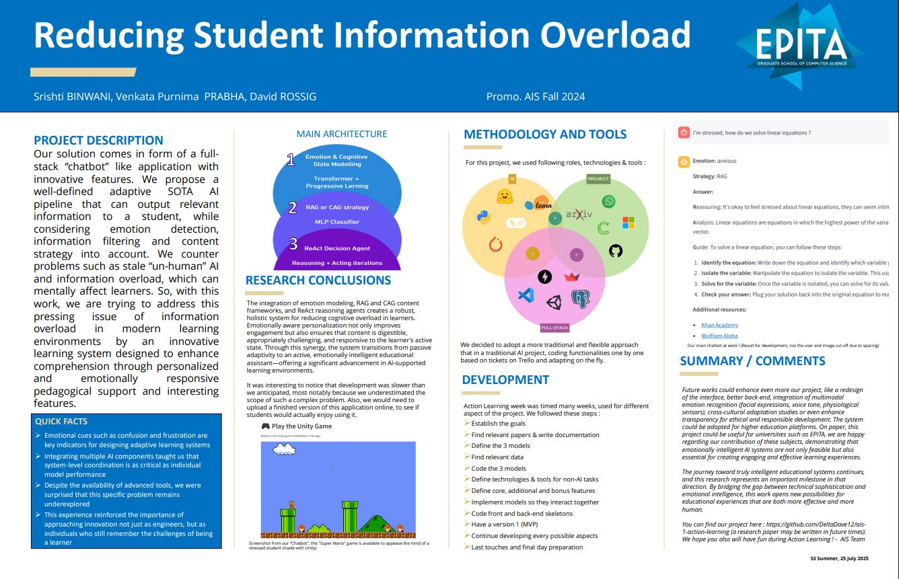
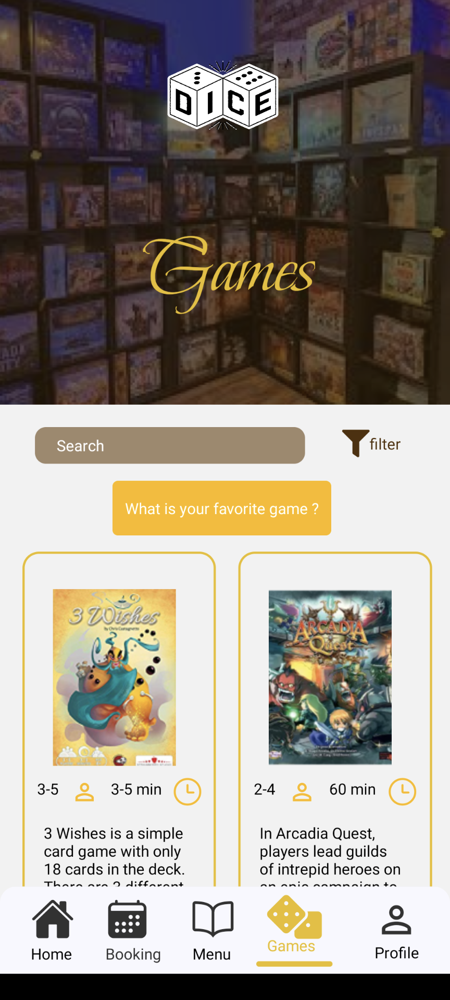

## WHAT IS THIS FOR ? 🤔

Hi, I'm David (DeltaDave), a young aspiring AI & Full-stack developer. I'm sharing this document so that you can visualize my personal and professional projects over the years in a cleaner way. You'll first see my three main projects and then some smaller side or miscellaneous works. A project is labeled/relatable as Artificial Intelligence (🧠), Software Engineering (👨‍💻) and/or Creativity (🖊️). Stay tuned and enjoy ! ✨

Status : Searching for AI related 6-month internship (preferably in startup or big company) 📜

Next project : AI for investment (not started) 🤑

Favorite character : Garfield 😼

Currently playing : Clash Royale 👑

Languages : French / German / English 🌍

## SUMMARY 💬

- [WHAT IS THIS FOR ?](#what)
- [SUMMARY](#summary)
- [ADAPTIVE AI CONVERSATIONAL LEARNING ASSISTANT FOR INFORMATION OVERLOAD (July 2025)](#project_1)
- [DICE BOARD GAME LOUNGE APP (March 2023)](#project_2)
- [MONEYROAD SRTP (September 2024)](#project_3)
- [OTHER PROJECTS](#project_others)

## [ADAPTIVE AI CONVERSATIONAL LEARNING ASSISTANT FOR INFORMATION OVERLOAD (July 2025 🧠/👨‍💻) 🏫](https://github.com/DeltaDave12/ais-1-action-learning)

Collaborators : [Shristi BINWANI](https://srishti-10.github.io/Portfolio/), [Purnima PRABHA](https://github.com/purnimaprabhav), [Alaa BAKHTI (Supervisor)](https://www.linkedin.com/in/alaabakhti/)

Technologies : Python, Torch, HuggingFace, Langchain, Streamlit, Poetry, Git

[Preview (click to see demo)](https://youtu.be/P3mC1KXs17A) :  

My most complete AI work. As a team, we propose a MVP showcasing an application made for school/universities students, to summarize, we programmed a simple inerface capable of answering scholar related questions, using a main LLM, that can use conversation context, information found on the web (or references) and most importantly, that can reason. In our research, Artificial Intelligence offers a promising avenue for addressing student learning limitations. By integrating emotion-aware models to this adaptive content delivery strategies, those AI systems can provide tailored learning experiences that align with both
the cognitive and emotional states of the learner. This project explores the development of
such a system, with the objective of enhancing learning efficiency and comprehension in
high-information environments.

This was part of EPITA's Action Learning Program, an integral part of my academic journey designed to provide hands-on experience in tackling cutting-edge challenges in data science and machine learning engineering. I've worked mainly on seting up the project through Poetry and Git, fine-tuning the Langchain ReAct AI and building the web interface. Even though a big basis is done, we would like to polish the project even further, deploy the app, add more documentation and potentially write a research paper about it. You can find more information and documentation by clicking [here](https://github.com/DeltaDave12/ais-1-action-learning).

## DICE BOARD GAME LOUNGE APP (March 2023 👨‍💻) 🎲

Collaborators : [Valentin THOMAS](https://github.com/Croniums) (Developer), [Marie WAHBA](https://www.linkedin.com/in/marie-wahba-753283260/) (Design), Sheldon WOLF (Design), [Yasser TURGUL](https://www.linkedin.com/in/yasser-turgul-127892227/) (Management)

Technologies : React Native, Expo, Firebase, Figma

[Preview (click to see demo)](https://youtu.be/uw7_v-gvTxs) :  

The "DBGL" mobile app is here to assist [Lee Purslow's](https://www.linkedin.com/in/lee-purslow/) "Dice Board Game Lounge" in advertising the place and help new customers get engaged in the brand. This fun project was part of my 2-months international mobility exchange collaboration between EPITA Paris and Portsmouth School of Creative Technologies, me and my colleagues needed to put our skills to the test while resepcting a deadline, to produce a prototype with modern functionalities. With my duo V. THOMAS, we worked with state-of-the-art mobile developement frameworks and libraries, meaning we handling all the programming for the application, based on design's and decisions brought by the other members and supervisors. Functionalites include authentification, data handling, user accesibility and online commands. Altough it's purely rule-based, we also implemented a "Game Buddy AI" that recommends a user a board game, depending on his experience with said games before (see demo).

## MONEYROAD SRTP (September 2024 👨‍💻) 💵

Collaborators : Streammind staff

Technologies : Vue JS, PHP, SQL, Git, Custom API

Preview (Content of app is confidential) :

As intended of my part-time work, I programmed on MoneyRoad RTP (Request to Pay), a web application for sending international payments and other automation options for bank related interactions. The main framework used was Vue JS, which I personally like a lot. Since Streammind is a service company specializing in applications and software, connecting its developers and their clients, I needed to adapt and react quickly to client demands. Globally, maintenance of this interface for bank payments was 70% front-end and 30% back-end, including but not limited to build : improved functionality, optmized code, simpler user experience, direct payment service, IBAN verification, vulnerability checks and strong authentication.

[EU Certification](https://www.linkedin.com/posts/streammind_moneyroad-streammind-bnpp-activity-7186354364440092673-PNUj?utm_source=share&utm_medium=member_desktop&rcm=ACoAADeaAsABvklGRoRGQiLgI_nvBzirL2n_bUs)

[MoneyRoad Labelisation](https://www.linkedin.com/posts/nicolas-muhadri-84686515_fintech-fintech-activity-7082043829096206336-WcYZ?utm_source=share&utm_medium=member_desktop&rcm=ACoAADeaAsABvklGRoRGQiLgI_nvBzirL2n_bUs)

## OTHER PROJECTS 🙂

- Two tower movie recommender system, AI project, 2025 🧠
- Pokemon No-SQL application, SE project, 2025 👨‍💻
- Pump sensors anomally detection, Time series analysis project, 2025 🧠
- Water pollution and Biodiversity around the world report, Data exploration & visualization notebook, 2025 🧠🖊️
- Restaurant Tips Prediction App, AI & data science project, 2024 🧠👨‍💻
- "Square en Folie", Designer for Paris Event, 2024 🖊️
- Yu-Gi-Oh API, Symfony API project, 2023 👨‍💻
- Gav & Dab, Co-creator of Youtube Channel, 2021 🖊️
